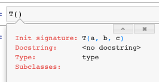
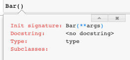
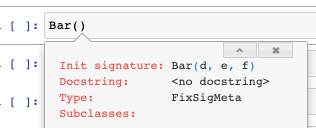

# Meta


<!-- WARNING: THIS FILE WAS AUTOGENERATED! DO NOT EDIT! -->

``` python
from fastcore.foundation import *
from nbdev.showdoc import *
from fastcore.nb_imports import *
```

See this [blog post](https://realpython.com/python-metaclasses/) for
more information about metaclasses.

- [`FixSigMeta`](https://fastcore.fast.ai/meta.html#fixsigmeta)
  preserves information that enables [intropsection of
  signatures](https://www.python.org/dev/peps/pep-0362/#:~:text=Python%20has%20always%20supported%20powerful,fully%20reconstruct%20the%20function's%20signature.)
  (i.e. tab completion in IDEs) when certain types of inheritence would
  otherwise obfuscate this introspection.
- [`PrePostInitMeta`](https://fastcore.fast.ai/meta.html#prepostinitmeta)
  ensures that the classes defined with it run `__pre_init__` and
  `__post_init__` (without having to write `self.__pre_init__()` and
  `self.__post_init__()` in the actual `init`
- [`NewChkMeta`](https://fastcore.fast.ai/meta.html#newchkmeta) gives
  the
  [`PrePostInitMeta`](https://fastcore.fast.ai/meta.html#prepostinitmeta)
  functionality and ensures classes defined with it don’t re-create an
  object of their type whenever it’s passed to the constructor
- [`BypassNewMeta`](https://fastcore.fast.ai/meta.html#bypassnewmeta)
  ensures classes defined with it can easily be casted form objects they
  subclass.

------------------------------------------------------------------------

<a
href="https://github.com/AnswerDotAI/fastcore/blob/master/fastcore/meta.py#L17"
target="_blank" style="float:right; font-size:smaller">source</a>

### test_sig

>  test_sig (f, b)

*Test the signature of an object*

``` python
def func_1(h,i,j): pass
def func_2(h,i=3, j=[5,6]): pass

class T:
    def __init__(self, a, b): pass

test_sig(func_1, '(h, i, j)')
test_sig(func_2, '(h, i=3, j=[5, 6])')
test_sig(T, '(a, b)')
```

------------------------------------------------------------------------

<a
href="https://github.com/AnswerDotAI/fastcore/blob/master/fastcore/meta.py#L28"
target="_blank" style="float:right; font-size:smaller">source</a>

### FixSigMeta

>  FixSigMeta (name, bases, dict)

*A metaclass that fixes the signature on classes that override
`__new__`*

When you inherit from a class that defines `__new__`, or a metaclass
that defines `__call__`, the signature of your `__init__` method is
obfuscated such that tab completion no longer works.
[`FixSigMeta`](https://fastcore.fast.ai/meta.html#fixsigmeta) fixes this
issue and restores signatures.

To understand what
[`FixSigMeta`](https://fastcore.fast.ai/meta.html#fixsigmeta) does, it
is useful to inspect an object’s signature. You can inspect the
signature of an object with `inspect.signature`:

``` python
class T:
    def __init__(self, a, b, c): pass
    
inspect.signature(T)
```

    <Signature (a, b, c)>

This corresponds to tab completion working in the normal way:



However, when you inherhit from a class that defines `__new__` or a
metaclass that defines `__call__` this obfuscates the signature by
overriding your class with the signature of `__new__`, which prevents
tab completion from displaying useful information:

``` python
class Foo:
    def __new__(self, **args): pass

class Bar(Foo):
    def __init__(self, d, e, f): pass
    
inspect.signature(Bar)
```

    <Signature (d, e, f)>



Finally, the signature and tab completion can be restored by inheriting
from the metaclass
[`FixSigMeta`](https://fastcore.fast.ai/meta.html#fixsigmeta) as shown
below:

``` python
class Bar(Foo, metaclass=FixSigMeta):
    def __init__(self, d, e, f): pass
    
test_sig(Bar, '(d, e, f)')
inspect.signature(Bar)
```

    <Signature (d, e, f)>



If you need to define a metaclass that overrides `__call__` (as done in
[`PrePostInitMeta`](https://fastcore.fast.ai/meta.html#prepostinitmeta)),
you need to inherit from
[`FixSigMeta`](https://fastcore.fast.ai/meta.html#fixsigmeta) instead of
`type` when constructing the metaclass to preserve the signature in
`__init__`. Be careful not to override `__new__` when doing this:

``` python
class TestMeta(FixSigMeta):
    # __new__ comes from FixSigMeta
    def __call__(cls, *args, **kwargs): pass
    
class T(metaclass=TestMeta):
    def __init__(self, a, b): pass
    
test_sig(T, '(a, b)')
```

On the other hand, if you fail to inherit from
[`FixSigMeta`](https://fastcore.fast.ai/meta.html#fixsigmeta) when
inheriting from a metaclass that overrides `__call__`, your signature
will reflect that of `__call__` instead (which is often undesirable):

``` python
class GenericMeta(type):
    "A boilerplate metaclass that doesn't do anything for testing."
    def __new__(cls, name, bases, dict):
        return super().__new__(cls, name, bases, dict)
    def __call__(cls, *args, **kwargs): pass

class T2(metaclass=GenericMeta):
    def __init__(self, a, b): pass

# We can avoid this by inheriting from the metaclass `FixSigMeta`
test_sig(T2, '(*args, **kwargs)')
```

------------------------------------------------------------------------

<a
href="https://github.com/AnswerDotAI/fastcore/blob/master/fastcore/meta.py#L36"
target="_blank" style="float:right; font-size:smaller">source</a>

### PrePostInitMeta

>  PrePostInitMeta (name, bases, dict)

*A metaclass that calls optional `__pre_init__` and `__post_init__`
methods*

`__pre_init__` and `__post_init__` are useful for initializing variables
or performing tasks prior to or after `__init__` being called,
respectively. Fore example:

``` python
class _T(metaclass=PrePostInitMeta):
    def __pre_init__(self):  self.a  = 0; 
    def __init__(self,b=0):  self.b = self.a + 1; assert self.b==1
    def __post_init__(self): self.c = self.b + 2; assert self.c==3

t = _T()
test_eq(t.a, 0) # set with __pre_init__
test_eq(t.b, 1) # set with __init__
test_eq(t.c, 3) # set with __post_init__
```

One use for
[`PrePostInitMeta`](https://fastcore.fast.ai/meta.html#prepostinitmeta)
is avoiding the `__super__().__init__()` boilerplate associated with
subclassing, such as used in
[`AutoInit`](https://fastcore.fast.ai/meta.html#autoinit).

------------------------------------------------------------------------

<a
href="https://github.com/AnswerDotAI/fastcore/blob/master/fastcore/meta.py#L47"
target="_blank" style="float:right; font-size:smaller">source</a>

### AutoInit

>  AutoInit (*args, **kwargs)

*Same as `object`, but no need for subclasses to call
`super().__init__`*

This is normally used as a
[mixin](https://www.residentmar.io/2019/07/07/python-mixins.html), eg:

``` python
class TestParent():
    def __init__(self): self.h = 10
        
class TestChild(AutoInit, TestParent):
    def __init__(self): self.k = self.h + 2
    
t = TestChild()
test_eq(t.h, 10) # h=10 is initialized in the parent class
test_eq(t.k, 12)
```

------------------------------------------------------------------------

<a
href="https://github.com/AnswerDotAI/fastcore/blob/master/fastcore/meta.py#L52"
target="_blank" style="float:right; font-size:smaller">source</a>

### NewChkMeta

>  NewChkMeta (name, bases, dict)

*Metaclass to avoid recreating object passed to constructor*

[`NewChkMeta`](https://fastcore.fast.ai/meta.html#newchkmeta) is used
when an object of the same type is the first argument to your class’s
constructor (i.e. the `__init__` function), and you would rather it not
create a new object but point to the same exact object.

This is used in [`L`](https://fastcore.fast.ai/foundation.html#l), for
example, to avoid creating a new object when the object is already of
type [`L`](https://fastcore.fast.ai/foundation.html#l). This allows the
users to defenisvely instantiate an
[`L`](https://fastcore.fast.ai/foundation.html#l) object and just return
a reference to the same object if it already happens to be of type
[`L`](https://fastcore.fast.ai/foundation.html#l).

For example, the below class `_T` **optionally** accepts an object `o`
as its first argument. A new object is returned upon instantiation per
usual:

``` python
class _T():
    "Testing"
    def __init__(self, o): 
        # if `o` is not an object without an attribute `foo`, set foo = 1
        self.foo = getattr(o,'foo',1)
```

``` python
t = _T(3)
test_eq(t.foo,1) # 1 was not of type _T, so foo = 1

t2 = _T(t) #t1 is of type _T
assert t is not t2 # t1 and t2 are different objects
```

However, if we want `_T` to return a reference to the same object when
passed an an object of type `_T` we can inherit from the
[`NewChkMeta`](https://fastcore.fast.ai/meta.html#newchkmeta) class as
illustrated below:

``` python
class _T(metaclass=NewChkMeta):
    "Testing with metaclass NewChkMeta"
    def __init__(self, o=None, b=1):
        # if `o` is not an object without an attribute `foo`, set foo = 1
        self.foo = getattr(o,'foo',1)
        self.b = b
```

We can now test `t` and `t2` are now pointing at the same object when
using this new definition of `_T`:

``` python
t = _T(3)
test_eq(t.foo,1) # 1 was not of type _T, so foo = 1

t2 = _T(t) # t2 will now reference t

test_is(t, t2) # t and t2 are the same object
t2.foo = 5 # this will also change t.foo to 5 because it is the same object
test_eq(t.foo, 5)
test_eq(t2.foo, 5)
```

However, there is one exception to how
[`NewChkMeta`](https://fastcore.fast.ai/meta.html#newchkmeta) works.
**If you pass any additional arguments in the constructor a new object
is returned**, even if the first object is of the same type. For
example, consider the below example where we pass the additional
argument `b` into the constructor:

``` python
t3 = _T(t, b=1)
assert t3 is not t

t4 = _T(t) # without any arguments the constructor will return a reference to the same object
assert t4 is t
```

Finally, it should be noted that
[`NewChkMeta`](https://fastcore.fast.ai/meta.html#newchkmeta) as well as
all other metaclases in this section, inherit from
[`FixSigMeta`](https://fastcore.fast.ai/meta.html#fixsigmeta). This
means class signatures will always be preserved when inheriting from
this metaclass (see docs for
[`FixSigMeta`](https://fastcore.fast.ai/meta.html#fixsigmeta) for more
details):

``` python
test_sig(_T, '(o=None, b=1)')
```

------------------------------------------------------------------------

<a
href="https://github.com/AnswerDotAI/fastcore/blob/master/fastcore/meta.py#L60"
target="_blank" style="float:right; font-size:smaller">source</a>

### BypassNewMeta

>  BypassNewMeta (name, bases, dict)

*Metaclass: casts `x` to this class if it’s of type `cls._bypass_type`*

[`BypassNewMeta`](https://fastcore.fast.ai/meta.html#bypassnewmeta) is
identical to
[`NewChkMeta`](https://fastcore.fast.ai/meta.html#newchkmeta), except
for checking for a class as the same type, we instead check for a class
of type specified in attribute `_bypass_type`.

In NewChkMeta, objects of the same type passed to the constructor
(without arguments) would result into a new variable referencing the
same object. However, with
[`BypassNewMeta`](https://fastcore.fast.ai/meta.html#bypassnewmeta) this
only occurs if the type matches the `_bypass_type` of the class you are
defining:

``` python
class _TestA: pass
class _TestB: pass

class _T(_TestA, metaclass=BypassNewMeta):
    _bypass_type=_TestB
    def __init__(self,x): self.x=x
```

In the below example, `t` does not refer to `t2` because `t` is of type
`_TestA` while `_T._bypass_type` is of type `TestB`:

``` python
t = _TestA()
t2 = _T(t)
assert t is not t2
```

However, if `t` is set to `_TestB` to match `_T._bypass_type`, then both
`t` and `t2` will refer to the same object.

``` python
t = _TestB()
t2 = _T(t)
t2.new_attr = 15

test_is(t, t2)
# since t2 just references t these will be the same
test_eq(t.new_attr, t2.new_attr)

# likewise, chaning an attribute on t will also affect t2 because they both point to the same object.
t.new_attr = 9
test_eq(t2.new_attr, 9)
```

## Metaprogramming

------------------------------------------------------------------------

<a
href="https://github.com/AnswerDotAI/fastcore/blob/master/fastcore/meta.py#L70"
target="_blank" style="float:right; font-size:smaller">source</a>

### empty2none

>  empty2none (p)

*Replace `Parameter.empty` with `None`*

------------------------------------------------------------------------

<a
href="https://github.com/AnswerDotAI/fastcore/blob/master/fastcore/meta.py#L75"
target="_blank" style="float:right; font-size:smaller">source</a>

### anno_dict

>  anno_dict (f)

*`__annotation__ dictionary with`empty`cast to`None\`, returning empty
if doesn’t exist*

``` python
def _f(a:int, b:L)->str: ...
test_eq(anno_dict(_f), {'a': int, 'b': L, 'return': str})
```

------------------------------------------------------------------------

<a
href="https://github.com/AnswerDotAI/fastcore/blob/master/fastcore/meta.py#L83"
target="_blank" style="float:right; font-size:smaller">source</a>

### use_kwargs_dict

>  use_kwargs_dict (keep=False, **kwargs)

*Decorator: replace `**kwargs` in signature with `names` params*

Replace all `**kwargs` with named arguments like so:

``` python
@use_kwargs_dict(y=1,z=None)
def foo(a, b=1, **kwargs): pass

test_sig(foo, '(a, b=1, *, y=1, z=None)')
```

Add named arguments, but optionally keep `**kwargs` by setting
`keep=True`:

``` python
@use_kwargs_dict(y=1,z=None, keep=True)
def foo(a, b=1, **kwargs): pass

test_sig(foo, '(a, b=1, *, y=1, z=None, **kwargs)')
```

------------------------------------------------------------------------

<a
href="https://github.com/AnswerDotAI/fastcore/blob/master/fastcore/meta.py#L97"
target="_blank" style="float:right; font-size:smaller">source</a>

### use_kwargs

>  use_kwargs (names, keep=False)

*Decorator: replace `**kwargs` in signature with `names` params*

[`use_kwargs`](https://fastcore.fast.ai/meta.html#use_kwargs) is
different than
[`use_kwargs_dict`](https://fastcore.fast.ai/meta.html#use_kwargs_dict)
as it only replaces `**kwargs` with named parameters without any default
values:

``` python
@use_kwargs(['y', 'z'])
def foo(a, b=1, **kwargs): pass

test_sig(foo, '(a, b=1, *, y=None, z=None)')
```

You may optionally keep the `**kwargs` argument in your signature by
setting `keep=True`:

``` python
@use_kwargs(['y', 'z'], keep=True)
def foo(a, *args, b=1, **kwargs): pass
test_sig(foo, '(a, *args, b=1, y=None, z=None, **kwargs)')
```

------------------------------------------------------------------------

<a
href="https://github.com/AnswerDotAI/fastcore/blob/master/fastcore/meta.py#L111"
target="_blank" style="float:right; font-size:smaller">source</a>

### delegates

>  delegates (to:function=None, keep=False, but:list=None)

*Decorator: replace `**kwargs` in signature with params from `to`*

<table>
<thead>
<tr>
<th></th>
<th><strong>Type</strong></th>
<th><strong>Default</strong></th>
<th><strong>Details</strong></th>
</tr>
</thead>
<tbody>
<tr>
<td>to</td>
<td>function</td>
<td>None</td>
<td>Delegatee</td>
</tr>
<tr>
<td>keep</td>
<td>bool</td>
<td>False</td>
<td>Keep <code>kwargs</code> in decorated function?</td>
</tr>
<tr>
<td>but</td>
<td>list</td>
<td>None</td>
<td>Exclude these parameters from signature</td>
</tr>
</tbody>
</table>

A common Python idiom is to accept `**kwargs` in addition to named
parameters that are passed onto other function calls. It is especially
common to use `**kwargs` when you want to give the user an option to
override default parameters of any functions or methods being called by
the parent function.

For example, suppose we have have a function `foo` that passes arguments
to `baz` like so:

``` python
def baz(a, b:int=2, c:int=3): return a + b + c

def foo(c, a, **kwargs):
    return c + baz(a, **kwargs)

assert foo(c=1, a=1) == 7
```

The problem with this approach is the api for `foo` is obfuscated. Users
cannot introspect what the valid arguments for `**kwargs` are without
reading the source code. When a user tries tries to introspect the
signature of `foo`, they are presented with this:

``` python
inspect.signature(foo)
```

    <Signature (c, a, **kwargs)>

We can address this issue by using the decorator
[`delegates`](https://fastcore.fast.ai/meta.html#delegates) to include
parameters from other functions. For example, if we apply the
[`delegates`](https://fastcore.fast.ai/meta.html#delegates) decorator to
`foo` to include parameters from `baz`:

``` python
@delegates(baz)
def foo(c, a, **kwargs):
    return c + baz(a, **kwargs)

test_sig(foo, '(c, a, *, b: int = 2)')
inspect.signature(foo)
```

    <Signature (c, a, *, b: int = 2)>

We can optionally decide to keep `**kwargs` by setting `keep=True`:

``` python
@delegates(baz, keep=True)
def foo(c, a, **kwargs):
    return c + baz(a, **kwargs)

inspect.signature(foo)
```

    <Signature (c, a, *, b: int = 2, **kwargs)>

It is important to note that **only parameters with default parameters
are included**. For example, in the below scenario only `c`, but NOT `e`
and `d` are included in the signature of `foo` after applying
[`delegates`](https://fastcore.fast.ai/meta.html#delegates):

``` python
def basefoo(e, d, c=2): pass

@delegates(basefoo)
def foo(a, b=1, **kwargs): pass
inspect.signature(foo) # e and d are not included b/c they don't have default parameters.
```

    <Signature (a, b=1, *, c=2)>

The reason that required arguments (i.e. those without default
parameters) are automatically excluded is that you should be explicitly
implementing required arguments into your function’s signature rather
than relying on
[`delegates`](https://fastcore.fast.ai/meta.html#delegates).

Additionally, you can exclude specific parameters from being included in
the signature with the `but` parameter. In the example below, we exclude
the parameter `d`:

``` python
def basefoo(e, c=2, d=3): pass

@delegates(basefoo, but= ['d'])
def foo(a, b=1, **kwargs): pass

test_sig(foo, '(a, b=1, *, c=2)')
inspect.signature(foo)
```

    <Signature (a, b=1, *, c=2)>

You can also use
[`delegates`](https://fastcore.fast.ai/meta.html#delegates) between
methods in a class. Here is an example of
[`delegates`](https://fastcore.fast.ai/meta.html#delegates) with class
methods:

``` python
# example 1: class methods
class _T():
    @classmethod
    def foo(cls, a=1, b=2):
        pass
    
    @classmethod
    @delegates(foo)
    def bar(cls, c=3, **kwargs):
        pass

test_sig(_T.bar, '(c=3, *, a=1, b=2)')
```

Here is the same example with instance methods:

``` python
# example 2: instance methods
class _T():
    def foo(self, a=1, b=2):
        pass
    
    @delegates(foo)
    def bar(self, c=3, **kwargs):
        pass

t = _T()
test_sig(t.bar, '(c=3, *, a=1, b=2)')
```

You can also delegate between classes. By default, the
[`delegates`](https://fastcore.fast.ai/meta.html#delegates) decorator
will delegate to the superclass:

``` python
class BaseFoo:
    def __init__(self, e, c=2): pass

@delegates()# since no argument was passsed here we delegate to the superclass
class Foo(BaseFoo):
    def __init__(self, a, b=1, **kwargs): super().__init__(**kwargs)

test_sig(Foo, '(a, b=1, *, c=2)')
```

------------------------------------------------------------------------

<a
href="https://github.com/AnswerDotAI/fastcore/blob/master/fastcore/meta.py#L137"
target="_blank" style="float:right; font-size:smaller">source</a>

### method

>  method (f)

*Mark `f` as a method*

The [`method`](https://fastcore.fast.ai/meta.html#method) function is
used to change a function’s type to a method. In the below example we
change the type of `a` from a function to a method:

``` python
def a(x=2): return x + 1
assert type(a).__name__ == 'function'

a = method(a)
assert type(a).__name__ == 'method'
```

------------------------------------------------------------------------

<a
href="https://github.com/AnswerDotAI/fastcore/blob/master/fastcore/meta.py#L159"
target="_blank" style="float:right; font-size:smaller">source</a>

### funcs_kwargs

>  funcs_kwargs (as_method=False)

*Replace methods in `cls._methods` with those from `kwargs`*

The `func_kwargs` decorator allows you to add a list of functions or
methods to an existing class. You must set this list as a class
attribute named `_methods` when defining your class. Additionally, you
must incldue the `**kwargs` argument in the `___init__` method of your
class.

After defining your class this way, you can add functions to your class
upon instantation as illusrated below.

For example, we define class `T` to allow adding the function `b` to
class `T` as follows (note that this function is stored as an attribute
of `T` and doesn’t have access to `cls` or `self`):

``` python
@funcs_kwargs
class T:
    _methods=['b'] # allows you to add method b upon instantiation
    def __init__(self, f=1, **kwargs): pass # don't forget to include **kwargs in __init__
    def a(self): return 1
    def b(self): return 2
    
t = T()
test_eq(t.a(), 1)
test_eq(t.b(), 2)
```

Because we defined the class `T` this way, the signature of `T`
indicates the option to add the function or method(s) specified in
`_methods`. In this example, `b` is added to the signature:

``` python
test_sig(T, '(f=1, *, b=None)')
inspect.signature(T)
```

    <Signature (f=1, *, b=None)>

You can now add the function `b` to class `T` upon instantiation:

``` python
def _new_func(): return 5

t = T(b = _new_func)
test_eq(t.b(), 5)
```

If you try to add a function with a name not listed in `_methods` it
will be ignored. In the below example, the attempt to add a function
named `a` is ignored:

``` python
t = T(a = lambda:3)
test_eq(t.a(), 1) # the attempt to add a is ignored and uses the original method instead.
```

Note that you can also add methods not defined in the original class as
long it is specified in the `_methods` attribute:

``` python
@funcs_kwargs
class T:
    _methods=['c']
    def __init__(self, f=1, **kwargs): pass

t = T(c = lambda: 4)
test_eq(t.c(), 4)
```

Until now, these examples showed how to add functions stored as an
instance attribute without access to `self`. However, if you need access
to `self` you can set `as_method=True` in the `func_kwargs` decorator to
add a method instead:

``` python
def _f(self,a=1): return self.num + a # access the num attribute from the instance

@funcs_kwargs(as_method=True)
class T: 
    _methods=['b']
    num = 5
    
t = T(b = _f) # adds method b
test_eq(t.b(5), 10) # self.num + 5 = 10
```

Here is an example of how you might use this functionality with
inheritence:

``` python
def _f(self,a=1): return self.num * a #multiply instead of add 

class T2(T):
    def __init__(self,num):
        super().__init__(b = _f) # add method b from the super class
        self.num=num
        
t = T2(num=3)
test_eq(t.b(a=5), 15) # 3 * 5 = 15
test_sig(T2, '(num)')
```
