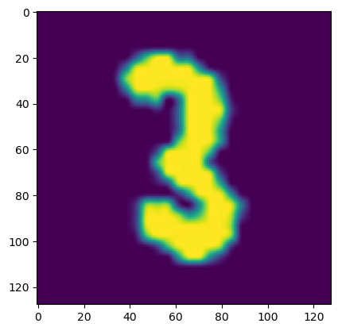

# Test


<!-- WARNING: THIS FILE WAS AUTOGENERATED! DO NOT EDIT! -->

## Simple test functions

We can check that code raises an exception when that’s expected
([`test_fail`](https://fastcore.fast.ai/test.html#test_fail)).

To test for equality or inequality (with different types of things) we
define a simple function
[`test`](https://fastcore.fast.ai/test.html#test) that compares two
objects with a given `cmp` operator.

------------------------------------------------------------------------

<a
href="https://github.com/AnswerDotAI/fastcore/blob/master/fastcore/test.py#L16"
target="_blank" style="float:right; font-size:smaller">source</a>

### test_fail

>  test_fail (f, msg='', contains='', args=None, kwargs=None)

*Fails with `msg` unless `f()` raises an exception and (optionally) has
`contains` in `e.args`*

``` python
def _fail(): raise Exception("foobar")
test_fail(_fail, contains="foo")

def _fail(): raise Exception()
test_fail(_fail)
```

We can also pass `args` and `kwargs` to function to check if it fails
with special inputs.

``` python
def _fail_args(a):
    if a == 5:
        raise ValueError
test_fail(_fail_args, args=(5,))
test_fail(_fail_args, kwargs=dict(a=5))
```

------------------------------------------------------------------------

<a
href="https://github.com/AnswerDotAI/fastcore/blob/master/fastcore/test.py#L26"
target="_blank" style="float:right; font-size:smaller">source</a>

### test

>  test (a, b, cmp, cname=None)

*`assert` that `cmp(a,b)`; display inputs and `cname or cmp.__name__` if
it fails*

``` python
test([1,2],[1,2], operator.eq)
test_fail(lambda: test([1,2],[1], operator.eq))
test([1,2],[1],   operator.ne)
test_fail(lambda: test([1,2],[1,2], operator.ne))
```

------------------------------------------------------------------------

### all_equal

>  all_equal (a, b)

*Compares whether `a` and `b` are the same length and have the same
contents*

``` python
test(['abc'], ['abc'], all_equal)
test_fail(lambda: test(['abc'],['cab'], all_equal))
```

------------------------------------------------------------------------

### equals

>  equals (a, b)

*Compares `a` and `b` for equality; supports sublists, tensors and
arrays too*

``` python
test([['abc'],['a']], [['abc'],['a']],  equals)
test([['abc'],['a'],'b', [['x']]], [['abc'],['a'],'b', [['x']]],  equals) # supports any depth and nested structure
```

------------------------------------------------------------------------

<a
href="https://github.com/AnswerDotAI/fastcore/blob/master/fastcore/test.py#L32"
target="_blank" style="float:right; font-size:smaller">source</a>

### nequals

>  nequals (a, b)

*Compares `a` and `b` for `not equals`*

``` python
test(['abc'], ['ab' ], nequals)
```

## test_eq test_ne, etc…

Just use
[`test_eq`](https://fastcore.fast.ai/test.html#test_eq)/[`test_ne`](https://fastcore.fast.ai/test.html#test_ne)
to test for `==`/`!=`.
[`test_eq_type`](https://fastcore.fast.ai/test.html#test_eq_type) checks
things are equal and of the same type. We define them using
[`test`](https://fastcore.fast.ai/test.html#test):

------------------------------------------------------------------------

<a
href="https://github.com/AnswerDotAI/fastcore/blob/master/fastcore/test.py#L37"
target="_blank" style="float:right; font-size:smaller">source</a>

### test_eq

>  test_eq (a, b)

*[`test`](https://fastcore.fast.ai/test.html#test) that `a==b`*

``` python
test_eq([1,2],[1,2])
test_eq([1,2],map(int,[1,2]))
test_eq(array([1,2]),array([1,2]))
test_eq(array([1,2]),array([1,2]))
test_eq([array([1,2]),3],[array([1,2]),3])
test_eq(dict(a=1,b=2), dict(b=2,a=1))
test_fail(lambda: test_eq([1,2], 1), contains="==")
test_fail(lambda: test_eq(None, np.array([1,2])), contains="==")
test_eq({'a', 'b', 'c'}, {'c', 'a', 'b'})
```

``` python
df1 = pd.DataFrame(dict(a=[1,2],b=['a','b']))
df2 = pd.DataFrame(dict(a=[1,2],b=['a','b']))
df3 = pd.DataFrame(dict(a=[1,2],b=['a','c']))

test_eq(df1,df2)
test_eq(df1.a,df2.a)
test_fail(lambda: test_eq(df1,df3), contains='==')
class T(pd.Series): pass
test_eq(df1.iloc[0], T(df2.iloc[0])) # works with subclasses
```

``` python
test_eq(torch.zeros(10), torch.zeros(10, dtype=torch.float64))
test_eq(torch.zeros(10), torch.ones(10)-1)
test_fail(lambda:test_eq(torch.zeros(10), torch.ones(1, 10)), contains='==')
test_eq(torch.zeros(3), [0,0,0])
```

------------------------------------------------------------------------

<a
href="https://github.com/AnswerDotAI/fastcore/blob/master/fastcore/test.py#L42"
target="_blank" style="float:right; font-size:smaller">source</a>

### test_eq_type

>  test_eq_type (a, b)

*[`test`](https://fastcore.fast.ai/test.html#test) that `a==b` and are
same type*

``` python
test_eq_type(1,1)
test_fail(lambda: test_eq_type(1,1.))
test_eq_type([1,1],[1,1])
test_fail(lambda: test_eq_type([1,1],(1,1)))
test_fail(lambda: test_eq_type([1,1],[1,1.]))
```

------------------------------------------------------------------------

<a
href="https://github.com/AnswerDotAI/fastcore/blob/master/fastcore/test.py#L49"
target="_blank" style="float:right; font-size:smaller">source</a>

### test_ne

>  test_ne (a, b)

*[`test`](https://fastcore.fast.ai/test.html#test) that `a!=b`*

``` python
test_ne([1,2],[1])
test_ne([1,2],[1,3])
test_ne(array([1,2]),array([1,1]))
test_ne(array([1,2]),array([1,1]))
test_ne([array([1,2]),3],[array([1,2])])
test_ne([3,4],array([3]))
test_ne([3,4],array([3,5]))
test_ne(dict(a=1,b=2), ['a', 'b'])
test_ne(['a', 'b'], dict(a=1,b=2))
```

------------------------------------------------------------------------

<a
href="https://github.com/AnswerDotAI/fastcore/blob/master/fastcore/test.py#L54"
target="_blank" style="float:right; font-size:smaller">source</a>

### is_close

>  is_close (a, b, eps=1e-05)

*Is `a` within `eps` of `b`*

------------------------------------------------------------------------

<a
href="https://github.com/AnswerDotAI/fastcore/blob/master/fastcore/test.py#L63"
target="_blank" style="float:right; font-size:smaller">source</a>

### test_close

>  test_close (a, b, eps=1e-05)

*[`test`](https://fastcore.fast.ai/test.html#test) that `a` is within
`eps` of `b`*

``` python
test_close(1,1.001,eps=1e-2)
test_fail(lambda: test_close(1,1.001))
test_close([-0.001,1.001], [0.,1.], eps=1e-2)
test_close(np.array([-0.001,1.001]), np.array([0.,1.]), eps=1e-2)
test_close(array([-0.001,1.001]), array([0.,1.]), eps=1e-2)
```

------------------------------------------------------------------------

<a
href="https://github.com/AnswerDotAI/fastcore/blob/master/fastcore/test.py#L68"
target="_blank" style="float:right; font-size:smaller">source</a>

### test_is

>  test_is (a, b)

*[`test`](https://fastcore.fast.ai/test.html#test) that `a is b`*

``` python
test_fail(lambda: test_is([1], [1]))
a = [1]
test_is(a, a)
b = [2]; test_fail(lambda: test_is(a, b))
```

------------------------------------------------------------------------

<a
href="https://github.com/AnswerDotAI/fastcore/blob/master/fastcore/test.py#L73"
target="_blank" style="float:right; font-size:smaller">source</a>

### test_shuffled

>  test_shuffled (a, b)

*[`test`](https://fastcore.fast.ai/test.html#test) that `a` and `b` are
shuffled versions of the same sequence of items*

``` python
a = list(range(50))
b = copy(a)
random.shuffle(b)
test_shuffled(a,b)
test_fail(lambda:test_shuffled(a,a))
```

``` python
a = 'abc'
b = 'abcabc'
test_fail(lambda:test_shuffled(a,b))
```

``` python
a = ['a', 42, True] 
b = [42, True, 'a']
test_shuffled(a,b)
```

------------------------------------------------------------------------

<a
href="https://github.com/AnswerDotAI/fastcore/blob/master/fastcore/test.py#L79"
target="_blank" style="float:right; font-size:smaller">source</a>

### test_stdout

>  test_stdout (f, exp, regex=False)

*Test that `f` prints `exp` to stdout, optionally checking as `regex`*

``` python
test_stdout(lambda: print('hi'), 'hi')
test_fail(lambda: test_stdout(lambda: print('hi'), 'ho'))
test_stdout(lambda: 1+1, '')
test_stdout(lambda: print('hi there!'), r'^hi.*!$', regex=True)
```

------------------------------------------------------------------------

<a
href="https://github.com/AnswerDotAI/fastcore/blob/master/fastcore/test.py#L87"
target="_blank" style="float:right; font-size:smaller">source</a>

### test_warns

>  test_warns (f, show=False)

``` python
test_warns(lambda: warnings.warn("Oh no!"))
test_fail(lambda: test_warns(lambda: 2+2), contains='No warnings raised')
```

``` python
test_warns(lambda: warnings.warn("Oh no!"), show=True)
```

    <class 'UserWarning'>: Oh no!

``` python
im = Image.open(TEST_IMAGE).resize((128,128)); im
```


``` python
im = Image.open(TEST_IMAGE_BW).resize((128,128)); im
```


------------------------------------------------------------------------

<a
href="https://github.com/AnswerDotAI/fastcore/blob/master/fastcore/test.py#L101"
target="_blank" style="float:right; font-size:smaller">source</a>

### test_fig_exists

>  test_fig_exists (ax)

*Test there is a figure displayed in `ax`*

``` python
fig,ax = plt.subplots()
ax.imshow(array(im));
```



``` python
test_fig_exists(ax)
```

------------------------------------------------------------------------

<a
href="https://github.com/AnswerDotAI/fastcore/blob/master/fastcore/test.py#L107"
target="_blank" style="float:right; font-size:smaller">source</a>

### ExceptionExpected

>  ExceptionExpected (ex=<class 'Exception'>, regex='')

*Context manager that tests if an exception is raised*

``` python
def _tst_1(): assert False, "This is a test"
def _tst_2(): raise SyntaxError

with ExceptionExpected(): _tst_1()
with ExceptionExpected(ex=AssertionError, regex="This is a test"): _tst_1()
with ExceptionExpected(ex=SyntaxError): _tst_2()
```

`exception` is an abbreviation for
[`ExceptionExpected()`](https://fastcore.fast.ai/test.html#exceptionexpected).

``` python
with exception: _tst_1()
```
